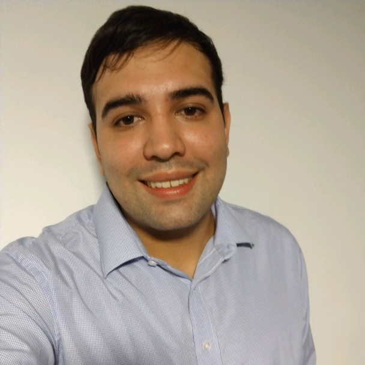

# Eduardo Ezequiel Ortiz

Hola a toda la cursada! Me llamo Ezequiel, soy estudiante de la carrera tecnicatura en programacion desde el 2022. Soy la clase de estudiante que siempre esta dispuesto a aprender y mantener firme el camino a pesar de que en ocaciones la trayectoria de la carrera se torna dificil.
Me eh dedicado a trabajar en obras para la construccion desempeñando el rubro de "pintor de obras" desde que egrese (2013) hasta el momento.
Eh empezado a cursar en la UNAHUR a mediados de 2021 en la carrera de tecnicatura en informatica si bien al principio fue muy dificil volver a estudiar, a travez de la perseverancia y la buena voluntad pudimos avanzar obstaculos muy dificiles, encontrandonos en esta materia. 

